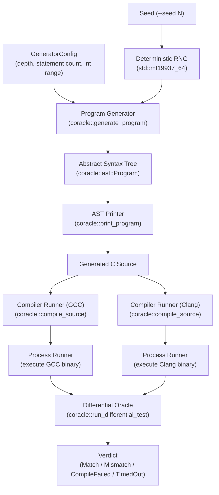
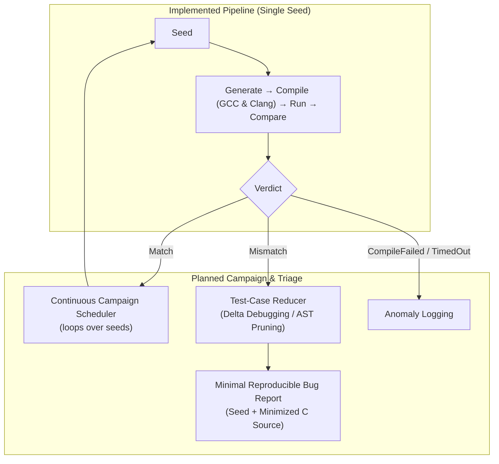

# COracle

**COracle** is an experimental C/C++ compiler bug detection framework based on **differential testing**. The project generates valid, syntactically well-formed C programs, compiles and executes them across multiple compilers (or across different optimization levels of the same compiler), and compares their observable runtime behavior to uncover compiler miscompilations, crashes, and code-generation discrepancies.

## Overview

Compilers such as GCC and Clang are complex software systems performing aggressive code optimizations. Verifying their correctness is notoriously difficult because there is rarely an automated formal "oracle" that can evaluate whether an arbitrary optimized binary preserves the semantics of an arbitrary C source program.

**Differential testing** addresses this test-oracle problem by compiling the same source program using multiple distinct compilers (e.g., GCC and Clang) or multiple optimization levels (e.g., `-O0`, `-O2`, `-O3`). Because all conforming compilers must adhere to the ISO C standard, the compiled binaries should produce identical observable output for any well-defined program. If one compiler's binary produces an output or exit code that differs from the others—or crashes during compilation—a potential compiler bug has been identified.

```text
                     ┌──────────────────┐
                     │ Generated Program│
                     └────────┬─────────┘
          ┌───────────────────┼───────────────────┐
          ▼                   ▼                   ▼
    ┌───────────┐       ┌───────────┐       ┌───────────┐
    │  GCC -O0  │       │  GCC -O3  │       │ Clang -O3 │
    └─────┬─────┘       └─────┬─────┘       └─────┬─────┘
          ▼                   ▼                   ▼
     [Binary A]          [Binary B]          [Binary C]
          │                   │                   │
          └───────────────────┼───────────────────┘
                              ▼
                 ┌────────────────────────┐
                 │  Differential Oracle   │
                 │   (Compare Outputs)    │
                 └────────────┬───────────┘
                              │
                    Discrepancy Found?
                    ├── No  ──> Continue Campaign
                    └── Yes ──> Report / Reduce
```

COracle is being built from the ground up as a research project. The repository currently implements the full single-seed differential testing pipeline: deterministic program generation, GCC and Clang compilation, isolated execution, and behavioral comparison. Multi-seed campaign scheduling, test-case reduction, and bug reporting are scheduled for subsequent development phases.

## Current Status

The table below reflects the **actual status of components implemented in the repository today**:

| Component | Status | Description |
| :--- | :--- | :--- |
| **Deterministic RNG** (`coracle::Rng`) | **Implemented** | Seeded PRNG wrapping `std::mt19937_64` ensuring fully reproducible generation sequences. |
| **AST Representation** (`coracle::ast`) | **Implemented** | Strongly-typed node hierarchy for expressions, variable declarations, assignments, and print statements. |
| **AST Printer** (`coracle::print_program`) | **Implemented** | Converts an AST into compilable, well-formatted C source text with defensive parenthesization. |
| **Random Program Generator** (`coracle::generate_program`) | **Implemented** | Generates constrained, scoped random ASTs within depth and variable-tracking bounds. |
| **Process Runner** (`coracle::run_process`) | **Implemented** | POSIX subprocess executor using `fork`, `execvp`, and pipes with timeout detection and output capping. |
| **Compiler Toolchain Wrapper** (`coracle::compile_source`) | **Implemented** | Invokes GCC or Clang via `process_runner`, captures diagnostics, reports success/failure/timeout. |
| **Differential Oracle** (`coracle::run_differential_test`) | **Implemented** | Compiles source with both GCC and Clang, runs both executables, compares stdout and exit codes. |
| **Verdict Classification** (`coracle::Verdict`) | **Implemented** | Distinguishes `Match`, `Mismatch`, `GccCompileFailed`, `ClangCompileFailed`, `GccRunTimedOut`, and `ClangRunTimedOut`. |
| **End-to-End CLI** (`src/main.cpp`) | **Implemented** | `coracle --seed <N>` runs the full pipeline (generate → compile → execute → compare) for a single seed. |
| **Test-Case Reducer** | *Planned* | Minimizes discrepancy-inducing programs down to small, isolated bug reports. |
| **Continuous Campaign Scheduler** | *Planned* | High-throughput fuzzing loop automating generation, execution, and artifact archiving. |

## Architecture

### Current Implemented Pipeline

The implemented pipeline takes an explicit 64-bit random seed, deterministically constructs a valid Abstract Syntax Tree (AST), prints that AST into standard C code, compiles it with both GCC and Clang, executes both binaries in isolated subprocesses, and compares their observable behavior (stdout and exit codes) to produce a differential verdict:


```mermaid
flowchart TD
    Seed["Seed (--seed N)"] --> RNG["Deterministic RNG\n(std::mt19937_64)"]
    Config["GeneratorConfig\n(depth, statement count, int range)"] --> Gen["Program Generator\n(coracle::generate_program)"]
    RNG --> Gen
    Gen --> AST["Abstract Syntax Tree\n(coracle::ast::Program)"]
    AST --> Printer["AST Printer\n(coracle::print_program)"]
    Printer --> CSource["Generated C Source"]
    CSource --> GCC["Compiler Runner (GCC)\n(coracle::compile_source)"]
    CSource --> Clang["Compiler Runner (Clang)\n(coracle::compile_source)"]
    GCC --> RunGCC["Process Runner\n(execute GCC binary)"]
    Clang --> RunClang["Process Runner\n(execute Clang binary)"]
    RunGCC --> Oracle["Differential Oracle\n(coracle::run_differential_test)"]
    RunClang --> Oracle
    Oracle --> Verdict["Verdict\n(Match / Mismatch / CompileFailed / TimedOut)"]
```

### Planned Extensions

The current pipeline handles a single seed end-to-end. Planned extensions will wrap this core into an automated, long-running differential fuzzing campaign:


```mermaid
flowchart TD
    subgraph Implemented["Implemented Pipeline (Single Seed)"]
        Seed["Seed"] --> Core["Generate → Compile (GCC & Clang) → Run → Compare"]
        Core --> Verdict{"Verdict"}
    end

    subgraph Planned["Planned Campaign & Triage"]
        Campaign["Continuous Campaign Scheduler\n(loops over seeds)"] --> Seed
        Verdict -->|"Match"| Campaign
        Verdict -->|"Mismatch"| Reducer["Test-Case Reducer\n(Delta Debugging / AST Pruning)"]
        Verdict -->|"CompileFailed / TimedOut"| TriageLog["Anomaly Logging"]
        Reducer --> BugReport["Minimal Reproducible Bug Report\n(Seed + Minimized C Source)"]
    end
```

## Current Implementation

The active codebase is organized into four modules (`src/generator/`, `src/executor/`, `src/compiler/`, `src/oracle/`), tied together by an end-to-end CLI entrypoint in `src/main.cpp`.

### 1. Deterministic Random Number Generator (`src/generator/rng.hpp`)

All random choices made during program generation pass through the `coracle::Rng` class rather than calling standard library distribution primitives directly.
* **Deterministic Engine**: Wraps `std::mt19937_64`, an engine with a large period ($2^{19937}-1$) and good statistical distribution properties.
* **Reproducibility**: Initialized with an explicit `uint64_t` seed. Given the same seed, `Rng` produces the exact same sequence of integers, booleans, and element choices.
* **Core API**:
  * `next_int(lo, hi)`: Uniform distribution over `[lo, hi]` (inclusive). Throws `std::invalid_argument` if `lo > hi`.
  * `next_bool(probability_true)`: Bernoulli distribution returning true with probability $p \in [0.0, 1.0]$.
  * `pick_one(vector<T>)`: Uniformly selects a reference to an element from a non-empty vector.

### 2. Abstract Syntax Tree (`src/generator/ast.hpp`)

Directly generating random C code as raw strings frequently produces syntactically invalid programs (e.g., mismatched braces, malformed expressions) that compilers reject in the parsing stage. Instead, COracle constructs a structured Abstract Syntax Tree (AST) using modern C++ memory management (`std::unique_ptr` ownership).

The AST currently implements a focused subset of C expressions and statements:
* **Expressions (`coracle::ast::Expr`)**:
  * `IntLiteral`: 64-bit integer constant (e.g., `42`, `-15`).
  * `VarRef`: Reference to an existing variable identifier (e.g., `v0`).
  * `BinaryExpr`: Binary operations holding owned left-hand and right-hand sub-expressions (`op` is either `BinaryOp::Add` or `BinaryOp::Sub`).
* **Statements (`coracle::ast::Stmt`)**:
  * `VarDecl`: Variable declaration with an initializing expression (`int <name> = <init>;`).
  * `Assign`: Reassignment of an existing variable (`<name> = <value>;`).
  * `PrintVar`: Printing a variable's value to standard output via `printf("%d\n", <name>);`.
* **Program (`coracle::ast::Program`)**:
  * Represents the body of a C `main` function as a flat list of `std::unique_ptr<Stmt>`.

### 3. AST Printer (`src/generator/ast_printer.hpp`, `ast_printer.cpp`)

The AST printer provides `std::string print_program(const ast::Program& program)`.
* **Pure Functionality**: Has no internal state, no random decisions, and no filesystem I/O.
* **Valid C Boilerplate**: Wraps generated statements within standard `#include <stdio.h>`, an `int main(void)` signature, and `return 0;`.
* **Defensive Parenthesization**: Every binary expression is rendered with explicit parentheses (e.g., `((a + b) - c)`), eliminating operator precedence ambiguities.
* **Deterministic Formatting**: Indents statement blocks cleanly with 4 spaces.

### 4. Random Program Generator (`src/generator/generator.hpp`, `generator.cpp`)

The generator converts pseudo-random decisions into a valid AST via `coracle::generate_program(rng, config)`.

Generation is parameterized by `coracle::GeneratorConfig`:
* `num_statements`: Total statements generated (default: `6`).
* `max_expr_depth`: Upper bound on recursive expression tree depth (default: `3`).
* `int_min` / `int_max`: Integer literal range (default: `[-100, 100]`).

Key generation mechanisms and constraints:
* **Scope Tracking**: Maintains a list of `declared_vars` as variables are created.
* **Valid Variable References**: A `VarRef` or assignment target can only be selected from `declared_vars`. The generator never references an undeclared variable.
* **Mandatory Initial Declaration**: The first statement of any generated program is forced to be a `VarDecl`, ensuring subsequent statements have a valid variable to reference or print.
* **Bounded Recursion**: The helper function `gen_expr` decrements `depth` at each binary node. When `depth <= 0`, it is forced to create a leaf (`IntLiteral` or `VarRef`), guaranteeing termination.

### 5. Process Runner (`src/executor/process_runner.hpp`, `process_runner.cpp`)

Compiling and executing untrusted or randomly generated programs carries risks of infinite loops, hangs, resource exhaustion, or terminal crashes. The process runner (`coracle::run_process`) executes external binaries safely in an isolated POSIX subprocess:
* **No Shell Execution**: Uses `execvp` directly without invoking `/bin/sh`. Arguments are passed as an exact argument vector (`argv`), preventing shell injection or metacharacter interpretation.
* **Subprocess Isolation**: Uses POSIX `fork` to isolate child execution from the main runner.
* **Piped Stream Capture**: Uses unidirectional POSIX `pipe`s and `dup2` to capture both `stdout` and `stderr` independently.
* **Non-Blocking Polling & Timeout Enforcement**: Uses `waitpid(..., WNOHANG)` alongside microsecond sleeps (`usleep`) to track child progress against a specified `timeout_seconds`. If a process hangs, `kill(pid, SIGKILL)` terminates it, followed by a blocking `waitpid` to reap the process and prevent zombie processes.
* **Output Size Capping**: Implements a per-stream output buffer cap (`kMaxOutputBytes = 1 MB`). If a program generates runaway output, the buffer stops appending and marks `output_truncated = true`, while continuing to drain the pipe so the child process does not deadlock on a full pipe buffer.
* **Structured Result (`ProcessResult`)**:
  * Captures `stdout_output` and `stderr_output`.
  * Records `exit_code` for normal exits (`WIFEXITED`).
  * Records signal terminations (`WIFSIGNALED`) as negative values (e.g., `-11` for `SIGSEGV`), allowing callers to distinguish between standard exits and abnormal crashes.
  * Sets `timed_out` boolean flag.

### 6. Compiler Runner (`src/compiler/compiler_runner.hpp`, `compiler_runner.cpp`)

The compiler runner provides `coracle::compile_source`, an abstraction over `run_process` that compiles a C source file into an executable binary using a selected compiler:
* **Compiler Selection**: The `CompilerKind` enum (`GCC`, `Clang`) maps via `compiler_command` to the system binary name (`"gcc"`, `"clang"`), resolved through `PATH` by `execvp`.
* **Minimal Baseline Invocation**: Currently invokes compilers without optimization flags (`<compiler> -o <output> <source>`), ensuring an identical, fair baseline across compilers. Any optimization flags (e.g., `-O2`, `-O3`) are intended as explicit experimental variables.
* **Structured Result (`CompileResult`)**:
  * `success`: `true` only if compilation succeeded and exited with code `0`.
  * `timed_out`: `true` if the compiler exceeded `timeout_seconds`.
  * `stderr_output`: Compiler diagnostics and warnings (captured even on successful compilations).
  * `executable_path`: Path to the generated binary (valid only when `success == true`).
* **Robust Rejection Handling**: Non-zero exit codes (syntax or semantic rejections) and negative exit codes (internal compiler crashes / ICE) both cleanly yield `success = false` rather than throwing exceptions.

### 7. Differential Oracle (`src/oracle/differential_oracle.hpp`, `differential_oracle.cpp`)

The differential oracle is the behavioral comparison engine. Given a C source string, `coracle::run_differential_test(source, compile_timeout, run_timeout)` performs a full differential test cycle:
1. **Isolated Workspace**: Creates a unique throwaway directory via `mkdtemp("/tmp/coracle_test_XXXXXX")`. An RAII guard (`TempDir`) guarantees recursive removal via `nftw` upon return or exception.
2. **Compilation**: Writes the source to `test.c` inside the temp directory, then compiles with GCC (`gcc_out`) and Clang (`clang_out`) via `compile_source`.
3. **Execution**: If both compilations succeed, runs both executables under isolated subprocesses with execution timeouts via `run_process`.
4. **Behavioral Comparison**: Compares stdout and exit codes between both executions.

**Verdict Classification (`coracle::Verdict`)**:

| Verdict | Meaning |
| :--- | :--- |
| `Match` | Both compilers produced executables that exited with identical exit codes and stdout output. |
| `Mismatch` | Both compiled and ran, but produced differing stdout output or exit codes — indicating a potential compiler discrepancy. |
| `GccCompileFailed` | GCC rejected the program with a non-zero exit code or crashed. |
| `ClangCompileFailed` | Clang rejected the program with a non-zero exit code or crashed. |
| `GccRunTimedOut` | GCC's compiled executable hung and was terminated by timeout. |
| `ClangRunTimedOut` | Clang's compiled executable hung and was terminated by timeout. |

> [!NOTE]
> Compilation failures and runtime timeouts are separated into dedicated verdicts instead of being lumped into `Mismatch`. This distinction preserves experimental validity: a mismatch strictly denotes a behavioral disagreement between two valid binaries.

**Structured Output (`DifferentialResult`)**:
Captures the `Verdict`, along with `gcc_stdout`, `clang_stdout`, `gcc_exit_code`, `clang_exit_code`, `gcc_compile_stderr`, and `clang_compile_stderr` for downstream analysis and debugging.

### 8. End-to-End CLI (`src/main.cpp`)

The `coracle` executable provides the single-seed entrypoint connecting the complete pipeline:

```bash
coracle --seed <number>
```

Execution flow:
1. Parses `--seed <number>` from command-line arguments.
2. Initializes `coracle::Rng` with the given seed.
3. Generates an AST via `generate_program(rng, config)`.
4. Emits C source text via `print_program(program)`.
5. Passes the source to `run_differential_test(source, 10, 5)`.
6. Prints the generated program, the verdict, and detailed outputs on `Mismatch` or compiler failure.
7. Exits with code `0` on `Match` / compile failures / timeouts, or `1` on `Mismatch`.

## Example

The transformation pipeline converts an initial seed into concrete, compilable C code:

```text
Seed: 7
  │
  ▼
[Deterministic RNG]
  │
  ▼
[Generator Decisions]
  ├── Statement 0: Must declare variable -> name="v0", init=(79 - -89)
  ├── Statement 1: Picked DoPrint -> target="v0"
  ├── Statement 2: Picked Declare -> name="v1", init=(( -39 + ( -47 - -42 ) ) - v0)
  ├── Statement 3: Picked Declare -> name="v2", init=v1
  ├── Statement 4: Picked DoAssign -> target="v1", value=v2
  └── Statement 5: Picked DoAssign -> target="v2", value=(-72 + (v1 - v1))
  │
  ▼
[AST Printer Output]
```

Actual output produced by the current printer with seed `7`:

```c
#include <stdio.h>

int main(void) {
    int v0 = (79 - -89);
    printf("%d\n", v0);
    int v1 = ((-39 + (-47 - -42)) - v0);
    int v2 = v1;
    v1 = v2;
    v2 = (-72 + (v1 - v1));
    return 0;
}
```

When compiled and executed, this program prints `168` to stdout and exits with code `0`.

## Reproducibility

Reproducibility is a primary design objective of COracle:

$$\text{Seed} + \text{GeneratorConfig} \longrightarrow \text{Exact Decision Sequence} \longrightarrow \text{Identical AST} \longrightarrow \text{Identical C Code}$$

Why this matters:
1. **Bug Isolation**: When differential testing discovers an output discrepancy or an Internal Compiler Error (ICE), saving the 64-bit seed and configuration is sufficient to reproduce the test case.
2. **Minimal Test Artifacts**: Large corpora of test files do not need to be saved to disk; seeds can be stored, logged, and replayed on demand.
3. **Deterministic Debugging**: Regressions in the generator or AST transformations can be caught immediately via unit and regression tests.

## Safety and Generation Constraints

The generator enforces strict structural and scoping constraints to produce valid programs:
* **Undeclared Variable Prevention**: Variable references (`VarRef`) and assignments (`Assign`) can only select from previously declared variables (`declared_vars`).
* **Strict Type Homogeneity**: Currently, all variables and expressions are typed as signed integers (`int`).
* **Controlled Value Ranges**: Integer literals are bounded by default to $[-100, 100]$.
* **Restricted Operator Subset**: Only binary addition (`+`) and subtraction (`-`) are generated.

### Important Note on Undefined Behavior (UB)

> [!WARNING]
> The current generator **does not claim or guarantee complete absence of Undefined Behavior (UB)**.

* **What is prevented**: The generator avoids obvious syntax errors, undeclared variable references, uninitialized variable reads, and operations known for trivial UB like division-by-zero or out-of-bounds pointer arithmetic (since division, pointers, arrays, and shift operators are not yet part of the AST).
* **What can still happen**: While literal values and expression depths are small, deep compositions of arithmetic operations could theoretically trigger signed integer overflow (which is undefined behavior in the C standard).
* **Design Strategy**: COracle intentionally begins with a minimal, tightly bounded language subset to keep the search space manageable and to minimize accidental UB. As language features expand (e.g., loops, conditionals, pointers), dedicated semantic validation and UB-avoidance passes will be incorporated into `src/validator/`.

## Project Structure

```text
COracle/
├── src/
│   ├── generator/                     # Random program generation pipeline
│   │   ├── rng.hpp                    # Deterministic pseudo-random number generator
│   │   ├── ast.hpp                    # AST node hierarchy (Expr, Stmt, Program)
│   │   ├── ast_printer.hpp            # AST printer header
│   │   ├── ast_printer.cpp            # AST printer implementation
│   │   ├── generator.hpp              # Generator configuration and interface
│   │   ├── generator.cpp              # Random AST generation logic
│   │   ├── test_rng_manual.cpp        # Manual test: RNG seed determinism
│   │   ├── test_ast_manual.cpp        # Manual test: AST construction
│   │   ├── test_printer_manual.cpp    # Manual test: AST code formatting
│   │   └── test_generator_manual.cpp  # Manual test: End-to-end program generation
│   │
│   ├── executor/                      # Subprocess management and execution
│   │   ├── process_runner.hpp         # Subprocess runner interface & ProcessResult
│   │   ├── process_runner.cpp         # POSIX fork/execvp/pipe implementation
│   │   └── test_process_runner_manual.cpp # Manual test: Subprocess execution & timeouts
│   │
│   ├── compiler/                      # Compiler toolchain invocation (GCC, Clang)
│   │   ├── compiler_runner.hpp        # Compiler runner interface & CompileResult
│   │   ├── compiler_runner.cpp        # Subprocess compilation via process_runner
│   │   └── test_compiler_runner_manual.cpp # Manual test: GCC compilation on valid/invalid C
│   │
│   ├── coverage/                      # (Planned) Coverage feedback and instrumentation
│   │
│   ├── oracle/                        # Differential comparison and verdict determination
│   │   ├── differential_oracle.hpp    # Oracle interface, Verdict enum, DifferentialResult
│   │   ├── differential_oracle.cpp    # TempDir RAII, execution, output/exit code comparison
│   │   └── test_oracle_manual.cpp     # Manual test: Match on valid C, GccCompileFailed on invalid
│   │
│   ├── reducer/                       # (Planned) Test-case reduction / delta debugging
│   ├── reporting/                     # (Planned) Bug reproduction logging
│   ├── scheduler/                     # (Planned) Fuzzing campaign loop
│   ├── validator/                     # (Planned) Semantic validation & UB avoidance
│   └── main.cpp                       # End-to-end CLI driver (coracle --seed <number>)
│
├── config/                            # Configuration files (e.g., config.toml)
├── corpus/                            # Test cases (crashes/, interesting/, seeds/)
├── docs/                              # Project and research documentation
├── results/                           # Experiment outputs and discrepancy logs
├── scripts/                           # Auxiliary scripts
├── tests/                             # Automated test suite (future)
├── CMakeLists.txt                     # Build configuration (placeholder)
├── .gitignore                         # Git exclusion rules
└── README.md                          # Project documentation
```

## Building and Testing

### Prerequisites

* Linux-based operating system (the `process_runner` relies on POSIX APIs: `fork`, `execvp`, `pipe`, `waitpid`).
* C++17 compliant compiler (`g++` or `clang++`).
* Both `gcc` and `clang` installed and available in `PATH` (invoked by the differential oracle).

### Compiling and Running Implemented Components

Currently, the project does not require an automated build tool like CMake or Make. The manual test drivers for each implemented component can be compiled directly:

#### 1. Test Deterministic RNG
Verifies that identical seeds yield identical pseudo-random number sequences, while different seeds diverge:
```bash
g++ -std=c++17 -Wall -Wextra src/generator/test_rng_manual.cpp -o test_rng
./test_rng
```

#### 2. Test AST Construction
Verifies that statement and expression nodes can be created and structured in memory:
```bash
g++ -std=c++17 -Wall -Wextra src/generator/test_ast_manual.cpp -o test_ast
./test_ast
```

#### 3. Test AST Printer
Verifies that an AST is rendered into valid C source text:
```bash
g++ -std=c++17 -Wall -Wextra src/generator/test_printer_manual.cpp src/generator/ast_printer.cpp -o test_printer
./test_printer
```

#### 4. Test Program Generator
Generates programs using fixed seeds and asserts reproducibility:
```bash
g++ -std=c++17 -Wall -Wextra src/generator/test_generator_manual.cpp src/generator/generator.cpp src/generator/ast_printer.cpp -o test_generator
./test_generator
```

#### 5. Test Subprocess Runner
Verifies command execution, standard output capture, timeout enforcement (killing a hanging command), and missing binary detection:
```bash
g++ -std=c++17 -Wall -Wextra src/executor/test_process_runner_manual.cpp src/executor/process_runner.cpp -o test_process_runner
./test_process_runner
```

#### 6. Test Compiler Runner
Verifies compiler invocation on valid C code and error capture on invalid C code:
```bash
g++ -std=c++17 -Wall -Wextra src/compiler/test_compiler_runner_manual.cpp src/compiler/compiler_runner.cpp src/executor/process_runner.cpp -o test_compiler_runner
./test_compiler_runner
```

#### 7. Test Differential Oracle
Verifies full differential comparison on a well-defined program (expecting `Match`) and malformed C (expecting `GccCompileFailed`):
```bash
g++ -std=c++17 -Wall -Wextra src/oracle/test_oracle_manual.cpp src/oracle/differential_oracle.cpp src/compiler/compiler_runner.cpp src/executor/process_runner.cpp -o test_oracle
./test_oracle
```

#### 8. Compiling a Generated Program Manually
You can redirect the generator output to a C source file and compile it directly using GCC:
```bash
./test_generator > generated.c
gcc -O2 generated.c -o generated_exe
./generated_exe
```

#### 9. Building and Running the End-to-End CLI
Build the complete `coracle` binary and run a single-seed differential test:
```bash
g++ -std=c++17 -Wall -Wextra src/main.cpp src/generator/generator.cpp src/generator/ast_printer.cpp src/oracle/differential_oracle.cpp src/compiler/compiler_runner.cpp src/executor/process_runner.cpp -o coracle
./coracle --seed 42
```

## Research Direction

The primary research objective of COracle is to evaluate how effective grammar-directed and constraint-guided random testing can be at uncovering optimizer bugs in modern compilers.

The planned experimental methodology follows a 7-step differential testing workflow:
1. **Constrained Program Generation**: Generate structurally valid, syntactically correct C programs.
2. **Multi-Target Compilation**: Compile each program using multiple compiler configurations (e.g., GCC vs. Clang, and across optimization flags `-O0`, `-O1`, `-O2`, `-O3`, `-Os`).
3. **Isolated Execution**: Run the resulting binaries within isolated subprocesses under identical input and resource constraints.
4. **Behavioral Comparison**: Compare standard output, standard error, and exit codes across configurations.
5. **Discrepancy Triage**: Separate true miscompilations from compiler crashes (ICE) or non-deterministic program behavior.
6. **Automated Test Reduction**: Shrink discovered discrepancy-triggering programs using delta debugging or syntax-guided minimization while preserving the failure mode.
7. **Artifact Generation**: Produce minimal, self-contained C files with compiler flags and system details suitable for upstream bug reporting.

## Roadmap

### Phase 1: Core Foundation *(Complete)*
- [x] Deterministic 64-bit RNG (`coracle::Rng`)
- [x] Initial AST node hierarchy (expressions, declarations, assignments, prints)
- [x] AST-to-C source printer (`coracle::print_program`)
- [x] Seed-driven random AST generator with basic scoping rules
- [x] Subprocess runner with timeout management and output limits (`coracle::run_process`)

### Phase 2: Compiler Invocation & Differential Oracle *(Current)*
- [x] Compiler invocation abstraction (`src/compiler/`) to wrap `gcc` and `clang`
- [x] Differential comparison oracle (`src/oracle/`) comparing outputs across GCC and Clang
- [x] Structured verdict classification (`coracle::Verdict` for Match, Mismatch, CompileFailed, TimedOut)
- [x] End-to-end CLI driver for single-seed differential testing (`src/main.cpp`)
- [ ] Optimization flag tiers (e.g., `-O0` vs `-O3`)
- [ ] CMake build system configuration for building targets and unit tests

### Phase 3: Language Expansion & Validation *(Planned)*
- [ ] Expansion of AST: unary operators, logical operators, `if`/`else` control flow, loops (`for`, `while`)
- [ ] Semantic validation and UB avoidance passes (`src/validator/`)
- [ ] Variable shadowing and block scope management

### Phase 4: Reduction & Automated Campaign *(Future)*
- [ ] Test-case reducer (`src/reducer/`) implementing hierarchical delta debugging
- [ ] Automated continuous fuzzing campaign loop (`src/scheduler/`)
- [ ] Automated bug reporting and seed replay utilities (`src/reporting/`)

## Design Principles

The design of COracle adheres to several key engineering principles:
* **Strict Reproducibility**: All random choices depend on explicit seeds passed through `coracle::Rng`. Any generated test case can be reproduced from its seed.
* **Structured AST Generation**: Generating an AST instead of random text guarantees syntactic validity and allows semantic constraints to be enforced before code generation.
* **Bounded Complexity**: Recursive expressions and statements are explicitly bounded to prevent infinite generation or excessively deep expression trees.
* **Process Isolation**: External programs and compilers are isolated via dedicated subprocesses with strict execution time limits and memory/output limits.
* **Independent Testability**: Every component (RNG, AST, Printer, Generator, Runner) is decoupled and independently verifiable.
* **Incremental Evolution**: Language features and compiler targets are added incrementally to ensure generator correctness at each stage.

## Research Context

COracle is being developed as a student research project investigating automated compiler testing and differential analysis techniques. It is designed to explore how constrained program synthesis and differential oracles can effectively detect subtle miscompilation bugs and crashes in modern production compilers.
